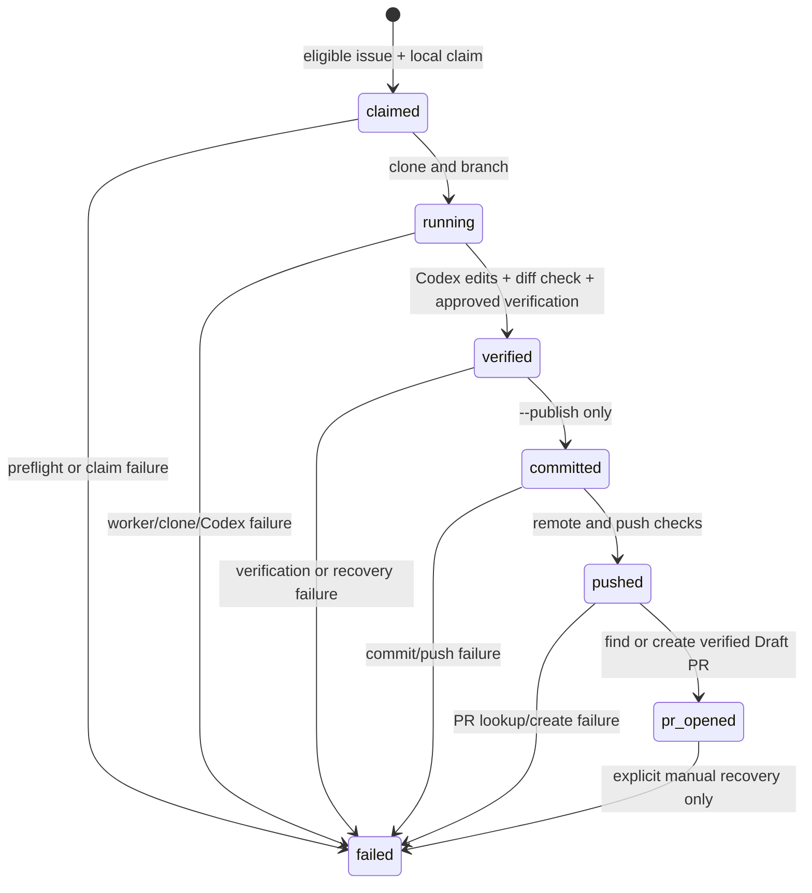

# Local-worker MVP architecture

PatchPool's MVP is one Node.js process running on one participant's computer.
It composes three local command adapters (Git, GitHub CLI, and Codex CLI) with a
SQLite state store. There is no hosted coordinator and no shared credential
service.

## State flow



The store records the claim, branch, workspace, commit SHA, PR URL, timestamps,
and error code after each side effect. A unique active-claim index prevents two
workers using the same SQLite database from claiming the same repository issue.
An execution lease fences concurrent execution of one claim and is renewed by
the worker heartbeat.

`run` without `--publish` stops at `verified`; it deliberately leaves the claim
active so an operator can inspect the worktree. `--publish` is the only path to
commit, push, and Draft-PR creation. On retry, `committed` and `pushed` states
reconcile the branch/PR before creating another remote object.

The self-dogfood command is `e2e --repo K-saint25/PatchPool --publish`.
The end-to-end path hard-guards that exact public repository and refuses to
run without explicit publish authorization.

## Boundaries and trust

| Boundary | Rule |
| --- | --- |
| Credentials | GitHub CLI and Codex keep their own local login state. PatchPool never stores credentials or accepts an API key for this flow. |
| Repository | Registration and every remote lookup require canonical `owner/name`, public, active, non-archived repositories. |
| Issue text | Untrusted. The prompt separates it from trusted instructions and forbids credential access, commit, push, and PR actions. |
| Codex worktree | `workspace-write` only; suspicious secret filenames are rejected and changes are verified before commit. |
| Subprocesses | Commands use argv arrays with `shell: false`; output is bounded and redacted. |
| Remote writes | Require `--publish`, a fresh branch, verified push remote, and a verified Draft PR in the canonical repository. |
| State | SQLite coordinates workers sharing one PC/database. It is not distributed coordination. |

## Configuration and implementation notes

`.patchpool.json` is the checked-in policy source loaded by `repo add`:

```json
{"verifyCommand":["npm","test"],"requiredIssueLabel":"patchpool-ready","timeoutMinutes":30}
```

`repo add --config .patchpool.json` validates the file, checks GitHub for the
canonical repository's public and non-archived status, and persists the
approved configuration snapshot. Omitting `--config` loads `.patchpool.json`
from the current working directory. The `verifyCommand` is executed as argv,
never through a shell. `timeoutMinutes` bounds both Codex implementation and
the configured verification command; clone, push, and pull-request operations
use separate bounded adapter deadlines.

The default database is `.patchpool.sqlite` in the current directory (or the
`PATCHPOOL_DB` path). Worktrees are created below the OS temporary directory
and cleaned up unless `--keep-workspace` is requested. Package publishing
excludes SQLite state, `.env` files, and worker workspaces through `.npmignore`.

`doctor` is read-only: it checks Node.js 24+, `gh` authentication, Codex
ChatGPT authentication, Git author identity, state-store readability, and that
worker signing is disabled. It does not claim issues or change the state DB.

## Failure and recovery boundaries

- A failed Codex or verification step is persisted as `failed`; fix the local
  cause and rerun after checking the recorded workspace and claim.
- A dry-run's `verified` claim is intentionally retained as a fail-safe. Stop
  the worker, resolve `PATCHPOOL_DB` (or the default `.patchpool.sqlite`), and
  back up the database plus adjacent `-wal`/`-shm` files before using supported
  state-recovery tooling. Never delete claim or lease rows just to unblock a
  retry.
- If process termination cannot be confirmed, the run stays pending. Do not
  start another worker until the process and its descendants have been checked.
- Windows termination uses `taskkill` by PID. PID reuse is a small residual
  risk even though termination is bounded and confirmation is attempted.
- An expired legacy execution lease with no owner PID/session metadata cannot
  be safely attributed to a dead process and therefore requires manual state
  recovery; it is never automatically reclaimed.
- If a branch was pushed, inspect its GitHub branch and Draft PR before retrying;
  the workflow should reconcile the recorded remote side effect rather than
  create a duplicate.
- The same SQLite database provides a local lock on one PC only. Two separate
  computers can still claim the same GitHub issue; central scheduling and
  distributed locks are outside this MVP.

These fail-safe choices may leave a claim pending longer than an optimistic
retry would, but they avoid silently duplicating work or remote writes.
